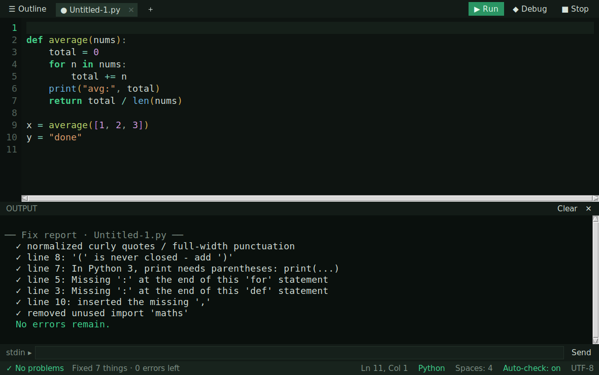

# GeskoIDE

GeskoIDE is an offline code editor with the Gecko Dark theme. This repository includes the original macOS `.command` app, a corrected Android APK build, and the GitHub Pages download site.

## Downloads

- macOS: `GeskoIDE.command`
- Android: `GeskoIDE.apk`

## Open GeskoIDE.command on Mac

Open Terminal and run:

```sh
cd ~/Downloads
chmod +x "GeskoIDE.command"
xattr -d com.apple.quarantine "GeskoIDE.command"
./"GeskoIDE.command"
```

## Install GeskoIDE.apk on Android

Download `GeskoIDE.apk` on your Android device, open it, and allow installation from your browser or file manager when Android asks.

The Android edition is a native offline editor with Gecko Dark styling, open/save through Android document picker, syntax coloring, templates, quick fixes, stronger per-language Check diagnostics, and a Debug button for every language. This APK keeps the smaller stable Android startup UI while using the same 24 language definitions and skeleton templates as the `.command` app: Python, JavaScript, TypeScript, HTML, CSS, JSON, Markdown, C, C++, C#, Java, Go, Rust, Ruby, PHP, Shell, Swift, Kotlin, Lua, SQL, YAML, AppleScript, Perl, and Plain Text.

Run works locally in the APK for all 24 languages without server APIs. Python runs through bundled Pyodide/CPython WebAssembly, Go through bundled Yaegi WebAssembly, JavaScript and basic TypeScript through the bundled WebView runner, SQL through Android SQLite, Shell through Android `/system/bin/sh`, HTML/CSS/Markdown/JSON through in-app preview or validation, and C, C++, C#, Java, Rust, Ruby, PHP, Swift, Kotlin, Lua, YAML, AppleScript, Perl, and Plain Text through the bundled Gesko polyglot runner. Debug uses real Python tracing, shell tracing, SQL query plans, JavaScript/TypeScript trace output, Go execution, and local polyglot traces for the other languages. See `THIRD_PARTY_NOTICES.md` for bundled runtime notices.

The macOS `.command` edition contains the full Python/Tkinter desktop IDE, a hover right-edge scrollbar, the same Outline navigator, and can run its built-in self-test with:

```sh
python3 GeskoIDE.command --selftest
```

## Fix Everything (GeckoFix deep repair engine)

Version 2.0 adds a deep repair engine — press **⇧⌘F** (or the *Fix all* button) and GeskoIDE repairs the whole file in iterative passes, entirely offline:

- **Python**: drives the real parser error-by-error — missing `:` and `,`, `'='` vs `'=='`, indentation problems (expected block / unexpected indent / unindent mismatch), unclosed strings and brackets, Python-2 `print` — then, once it parses, fixes **typos by fuzzy rename** (`maths.pi` → `math.pi`), **auto-imports** stdlib modules you used, and removes unused imports.
- **C / C++**: compiles with clang/gcc `-fdiagnostics-parseable-fixits` and applies the compiler's own machine-readable repairs (missing `;`, `vectr` → `vector`, `.` vs `->`, …) in a loop until clean.
- **Everything**: curly “smart quotes” and full-width ；：，punctuation from web pastes are normalized (valid string contents are left alone), and layout is fixed — indentation snapped to the language grid, trailing whitespace stripped.
- **Format Document** (**⇧⌘L**) formats with `gofmt` / `rustfmt` / `clang-format` when installed, else the built-in reindenter.

Each run prints an itemized *Fix report* in the output console and ends with how many errors remain (usually zero):



## Build the APK

The APK can be rebuilt on a Mac with Android Studio installed:

```sh
./android/build-tools/build_apk.sh
```

The script uses Android Studio's bundled JDK, the local Android SDK, and the checked-in GeskoIDE signing key, then writes `GeskoIDE.apk` at the repository root.

## Support

Bitcoin address:

```text
1G3owA2kPUuYS45XGyj8p8M3kgdHQzePBs
```

The donation QR code is included as `bitcoin-qr.jpg`.
